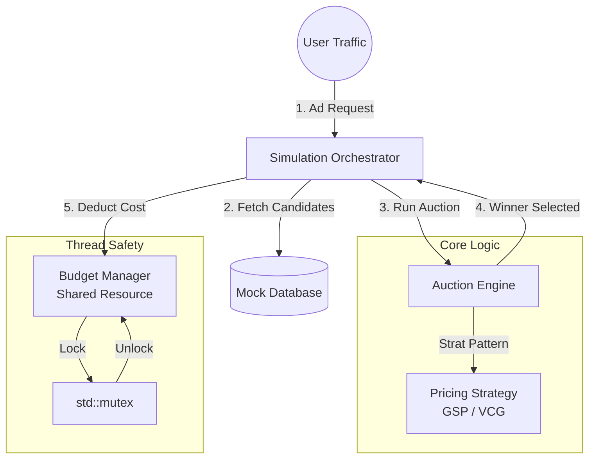

# High-Throughput Real-Time Bidding (RTB) Engine

  

## 📖 Overview
This project is a high-performance simulation of an **Ad Exchange Backend**, designed to mimic the infrastructure used by Google Ads. It handles concurrent ad auctions in real-time, ensuring thread safety and strict latency constraints.

The core engine implements the **Generalized Second-Price (GSP)** auction algorithm—the industry standard for allocating ad slots—while managing shared financial state (advertiser budgets) using distinct mutex-based locking strategies to prevent race conditions.

## 🏗 System Architecture
The system follows a modular architecture, strictly separating the **stateless** auction logic from the **stateful** financial records.


## 🚀 Key Features

### 1. Generalized Second-Price (GSP) Auction
Instead of the highest bidder paying their own bid (First-Price), the winner pays the price determined by the **runner-up**. This encourages truthful bidding.

**The Math:**
$$Price_{winner} = \frac{Rank_{runner-up}}{Quality_{winner}} + 0.01$$

Where:
* $Rank = Bid \times QualityScore$

### 2. Thread-Safe Budget Management
The system handles financial transactions using **Pessimistic Locking** (`std::mutex`).
* **Atomicity:** The "Check Balance" and "Deduct Funds" operations are wrapped in a single critical section.
* **Consistency:** Prevents "Double Spending" even when 10+ threads attempt to charge the same advertiser simultaneously.

### 3. Modular Low-Level Design (LLD)
* **Strategy Pattern:** The `PricingStrategy` interface allows runtime switching between auction types (e.g., swapping GSP for VCG).
* **Dependency Injection:** The Engine does not own the Budget Manager, allowing for easier unit testing and mocking.

---

## 🛠 Project Structure

```bash
├── auction_engine.h      # Interface for Pricing Strategies
├── auction_engine.cpp    # GSP Algorithm Implementation
├── budget_manager.h      # Interface for the "Bank"
├── budget_manager.cpp    # Thread-safe budget logic (Mutex protected)
├── main.cpp              # Multi-threaded simulation entry point
└── README.md             # Documentation
```
## ⚡ Performance & Trade-offs

| Component | Design Choice | Reason | Trade-off |
| :--- | :--- | :--- | :--- |
| **Concurrency** | `std::mutex` | Guarantees strict financial consistency (ACID). | Higher latency under extreme contention compared to lock-free structures. |
| **Language** | C++17 | Manual memory management and low-level thread control. | Higher development complexity than Java/Python. |
| **Ranking** | GSP | Industry standard for balancing revenue and user experience. | More complex to compute than First-Price auctions. |

---

## 💻 How to Run

### Prerequisites
* C++ Compiler supporting C++17 (GCC, Clang, or MinGW-w64).
* Standard Template Library (STL).

### Build & Execute
Run the following command in your terminal to link all modules and start the server:

```bash
# 1. Compile
g++ -std=c++17 main.cpp budget_manager.cpp auction_engine.cpp -o ad_server

# 2. Run
./ad_server
```
### Expected Output
You will see the simulation results demonstrating successful sales and, crucially, **"Missed Opportunities"**. This positive number proves the `BudgetManager` successfully blocked threads from overspending empty budgets.

```text
--- Simulation Finished ---
Time Elapsed: 0.124 seconds
Total Auctions: 1000
Successful Sales: 655
Missed Opportunities (Budget Exhausted): 345
```
🔮 Future Improvements
Distributed Locking: Replace local std::mutex with Redis Distributed Locks (Redlock) to support scaling across multiple servers.

Network Layer: Wrap the engine in a gRPC service to handle remote requests.

Smart Pacing: Implement a probabilistic throttling algorithm to space out budget spending evenly throughout the day.
